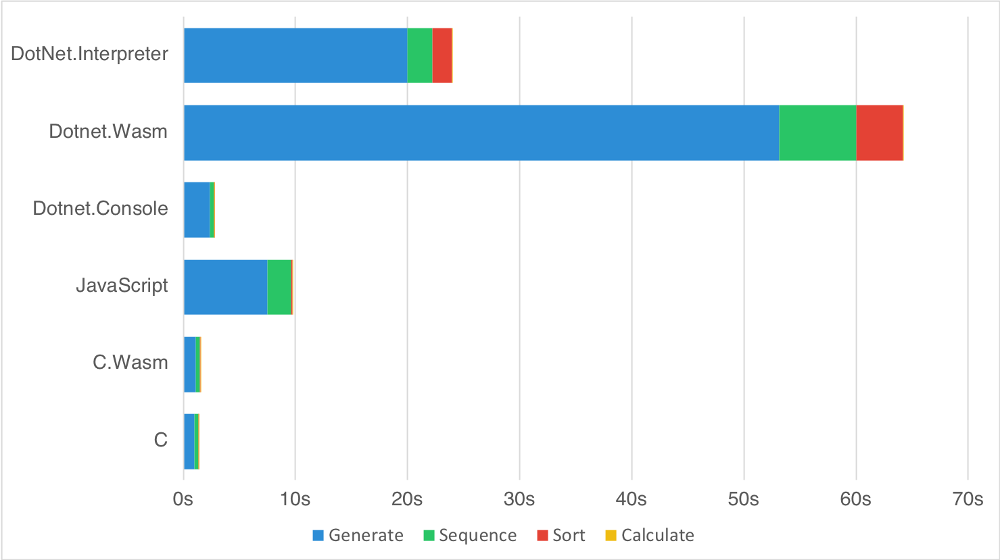

# Current state of WebAssembly and mono-wasm Performance

## Benchmark Information

The Benchmark currently performs the following four tasks:

* Generate 100,000 random gene sequences with a length of 1000 letters
* Transcribes the DNA to the resulting proteins and calculates the ratio of leucine to serine
* Sort the resulting list of ratios by their values
* Calculates Q1, Median, Q3 and calculate average and standard deviation

## Platform Information

The Benchmark was implemented in the following languages/platforms:

* **C** → clang 6.0.1
* **C.Wasm** → emcc 1.38.6 (emcc needs to be in PATH variable)
* **JavaScript** → TypeScript 2.8.1 (tsc needs to be in PATH variable)
* **DotNet.Console** → .NET Core 2.1.300
* **DotNet.Interpreter** → Mono 5.14.0
* **DotNet.Wasm** → mono-wasm commit 55360b5 ($WASM_SDK variable needs to be set)

The .NET Projects where build with `Release` configuration and the C Projects with `-Os` optimizations.

## Results

The following results were recorded on a MacBook Pro (Retina, 15-inch, Late 2013) and where applicable Firefox 62.0 was used as the browser.

| Benchmark |        C |   C.Wasm | JavaScript | Dotnet.Console | Dotnet.Wasm | DotNet.Interpreter |
|-----------|---------:|---------:|-----------:|---------------:|------------:|-------------------:|
| Generate  | 1,012.05 | 1,089.20 |   7,485.90 |       2,351.48 |   53,166.40 |          20,005.41 |
| Sequence  |   327.49 |   410.00 |   2,158.70 |         368.03 |    6,875.00 |           2,235.60 |
| Sort      |    29.54 |    45.40 |      65.60 |          43.44 |    4,136.80 |           1,709.73 |
| Calculate |     0.01 |     1.00 |       2.00 |           1.11 |       17.40 |               6.12 |
|           | 1,369.09 | 1,545.60 |   9,712.20 |       2,764.06 |   64,195.60 |          23,956.86 |

