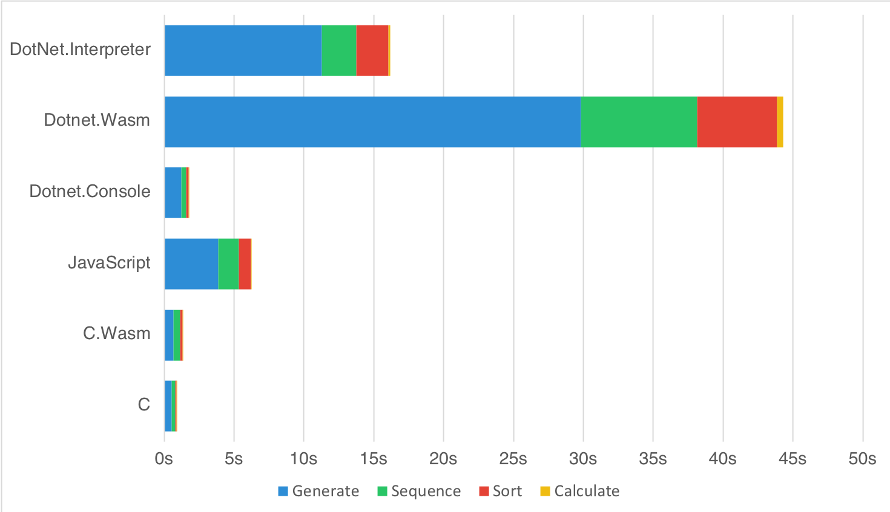

# Current state of WebAssembly and mono-wasm Performance

## Benchmark Information

The Benchmark currently performs the following four tasks:

* Generate 500,000 random gene sequences with a length of 100 letters
* Transcribes the DNA to the resulting proteins and calculates the ratio of polar to nonpolar and basic to acidic proteins
* Separately sort the two resulting list of ratios by their values
* Calculates Q1, Median, Q3 and calculate average and standard deviation for those lists

## Platform Information

The Benchmark was implemented in the following languages/platforms:

* **C** → clang 6.0.1
* **C.Wasm** → emcc 1.38.6 (emcc needs to be in PATH variable)
* **JavaScript** → TypeScript 2.8.1 (tsc needs to be in PATH variable)
* **DotNet.Console** → .NET Core 2.1.300
* **DotNet.Interpreter** → Mono 5.14.0
* **DotNet.Wasm** → mono-wasm commit 55360b5 ($WASM_SDK variable needs to be set)

The .NET Projects where build with `Release` configuration and the C Projects with `-O3` optimizations.

## Results

The following results were recorded on a MacBook Pro (Retina, 15-inch, Late 2013) and where applicable Firefox 62.0 was used as the browser.

| Benchmark |    C   |  C.Wasm  | JavaScript | Dotnet.Console | Dotnet.Wasm | DotNet.Interpreter |
|-----------|:------:|:--------:|:----------:|:--------------:|:-----------:|:------------------:|
| Generate  | 527.54 |   673.00 |   3,869.00 |       1,227.88 |   29,832.00 |          11,276.61 |
| Sequence  | 282.58 |   495.00 |   1,484.00 |         361.35 |    8,295.00 |           2,467.20 |
| Sort      |  83.90 |   167.00 |     878.00 |         163.68 |    5,754.00 |           2,287.95 |
| Calculate |   3.80 |     8.00 |      20.00 |           5.93 |      394.00 |             141.59 |
|           | 897.82 | 1,343.00 |   6,251.00 |       1,758.84 |   44,275.00 |          16,173.35 |

