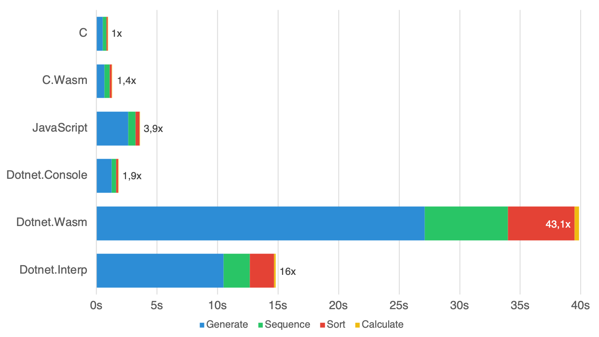
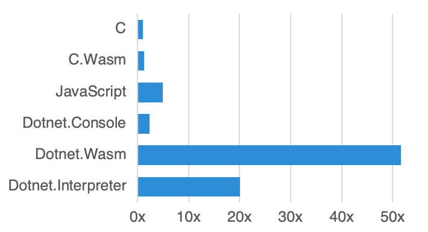
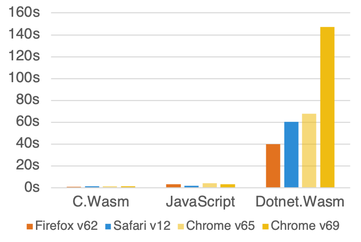

# Current state of WebAssembly and mono-wasm Performance

## Benchmark Information

The Benchmark currently performs the following four tasks:

* Generate 500,000 random gene sequences with a length of 100 letters
* Transcribes the DNA to the resulting proteins and calculates the ratio of polar to nonpolar and basic to acidic proteins
* Separately sort the two resulting list of ratios by their values
* Calculates Q1, Median, Q3 and calculate average and standard deviation for those lists

## Platform Information

The Benchmark was implemented in the following languages/platforms:

* **C** → clang 6.0.1
* **C.Wasm** → emcc 1.38.6 (emcc needs to be in PATH variable)
* **JavaScript** → TypeScript 2.8.1 (tsc needs to be in PATH variable)
* **DotNet.Console** → .NET Core 2.1.300
* **DotNet.Interpreter** → Mono 5.14.0
* **DotNet.Wasm** → mono-wasm commit c211324 ($WASM_SDK variable needs to be set)

The .NET Projects where build with `Release` configuration and the C Projects with `-O3` optimizations.

## Results

The following results were recorded on a MacBook Pro (Retina, 15-inch, Late 2013) and where applicable Firefox 62.0 was used as the browser.

| Benchmark |          C |       C.Wasm |   JavaScript | Dotnet.Console |   Dotnet.Wasm | DotNet.Interp |
|-----------|-----------:|-------------:|-------------:|---------------:|--------------:|--------------:|
| Generate  |     529.92 |       675.90 |     3,022.00 |       1,255.31 |     27,612.40 |     10,866.80 |
| Sequence  |     284.10 |       491.20 |       579.10 |         364.82 |      8,310.80 |      2,503.20 |
| Sort      |      83.89 |       164.30 |       330.80 |         172.32 |      5,649.30 |      2,065.82 |
| Calculate |       3.58 |         5.50 |        11.40 |           6.62 |        395.00 |        130.21 |
|           | **901.49** | **1,336.90** | **3,943.30** |   **1,799.06** | **41,967.50** | **15,566.04** |

### Detail Results

 
 

### Browser Results

 
